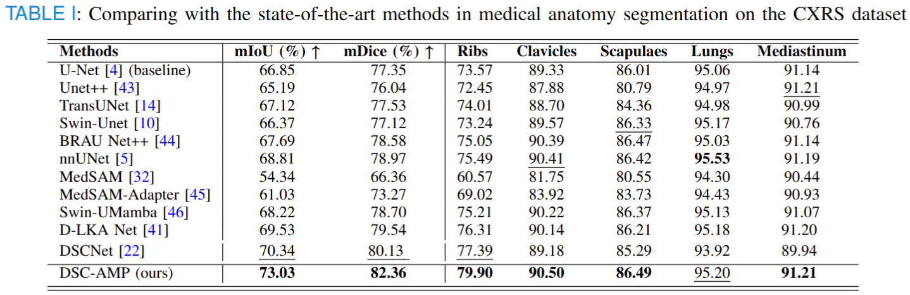
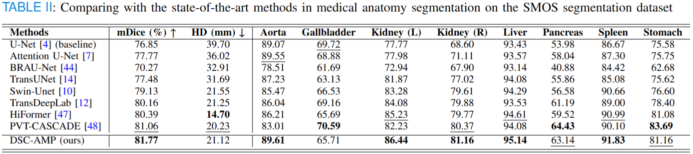
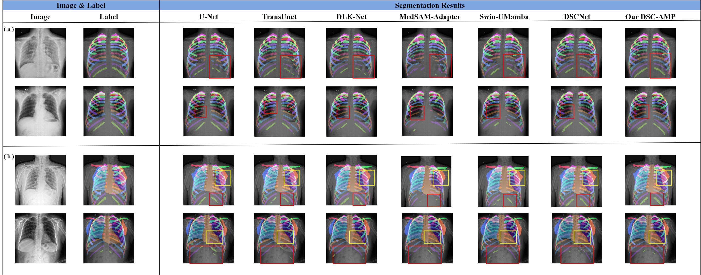
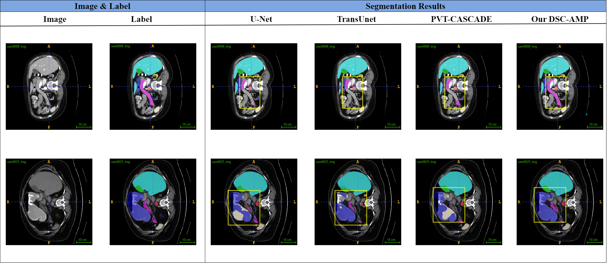
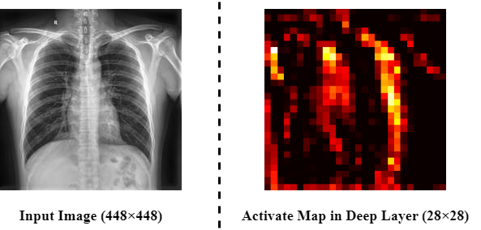

 # The Official Implementation of DSC-AMP

**Dynamic Strip Convolution and Adaptive Morphology Perception Plugin for Medical Anatomy Segmentation**                        
Guyue Hu, Yukun Kang, Gangming Zhao, Zhe Jin, Chenglong Li, and Jin Tang

### **Abstract**

Medical anatomy segmentation is essential for computer-aided diagnosis and lesion localization in medical images. For example, segmenting individual ribs benefits localizing the lung lesions and providing vital medical measurements (such as rib spacing) for generating medical reports. Existing methods segment shape-different anatomies (such as striped ribs, bulky lungs, and angular scapula) with the same network architecture, the morphology heterogeneity is heavily overlooked. Although some shape-aware operators like deformable convolution and dynamic snake convolution have been introduced to cater to specific object morphology, they still struggle with orientation-varying strip structures, such as 24 ribs and 2 clavicles. In this paper, we propose a novel convolutional plugin (DSC-AMP) for medical anatomy segmentation, which is comprised of a dynamic strip convolution (DSC) operator and an adaptive morphology perception (AMP) strategy. Specifically, the dynamic strip convolution customizes gradually varying directions and offsets for each local region, achieving dynamic striped receptive fields. Additionally, the adaptive morphology perception strategy incorporates insights from various shape-aware convolutional kernels, enabling the model to discern and integrate crucial representations corresponding to heterogeneous anatomies. Extensive experiments on two large-scale datasets demonstrate the effectiveness and superiority of the proposed approach for tackling heterogeneous medical anatomy segmentation.

## Features

#### 1. Datasets

- [X]  Synapse
- [ ]  CXRS

#### 2. Task

- [X]  Medical Anatomy Segmentation

#### 3. Visualization Results

* [X]  CXRS
* [X]  Synapse

## Prerequisites

Our code is based on **Python3.5**. There are a few dependencies to run the code in the following:

- Python == 3.10
- **PyTorch >= 2.0.0**
- TensorboardX
- Other version info about some Python packages can be found in `requirements.txt`

## Usage

#### Data Preparation

##### Synapse Dataset

Download the Synapse dataset from ([Synapse Dataset Download](https://help.synapse.org/docs/Datasets.2611281979.html)) and place the training set and test set in Synapse_Dataset\train_npz and Synapse_Dataset\test_vol_h5, respectively.

##### CXRS Dataset

Waiting till the dataset is open.

#### Training

For the training procedure, you should run the command line below

```To
python train.py --dataset Syanpse --root_path your DATA_DIR --max_epochs 400 --output_dir your OUT_DIR  --img_size 224 --base_lr 0.05 --batch_size 24
```

#### Testing

For the testing procedure, you should run the command line below

```commandline
python test.py --dataset Synapse --is_savenii --volume_path your DATA_DIR --output_dir your OUT_DIR --max_epoch 400 --base_lr 0.05 --img_size 224 --batch_size 24
```

## Results

#### Table
- Table 1 -CXRS
<div align="center">
    
</div>

- Table 2 -Synapse
<div align="center">
    
</div>


#### Visualization
- Figure 1 -CXRS
<div align="center">
    
</div>

- Figure 2 -Synapse
<div align="center">
    
</div>


## Appendix

- Figure S1 -Deep Layer Activation Map
<div align="center">
    
</div>

## Reference

[1] Qi Y, He Y, Qi X, et al. Dynamic snake convolution based on topological geometric constraints for tubular structure segmentation. ICCV 2023.

[2] [BRAU-Net++](https://github.com/Caipengzhou/BRAU-Netplusplus): referred for some code for processing Synpase dataset.
